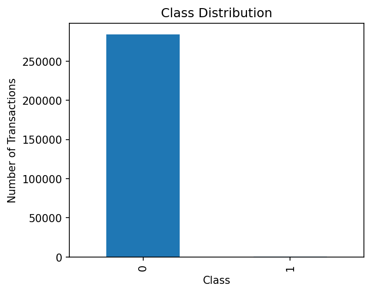
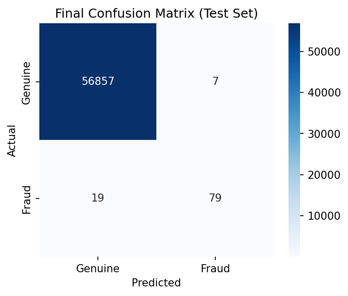
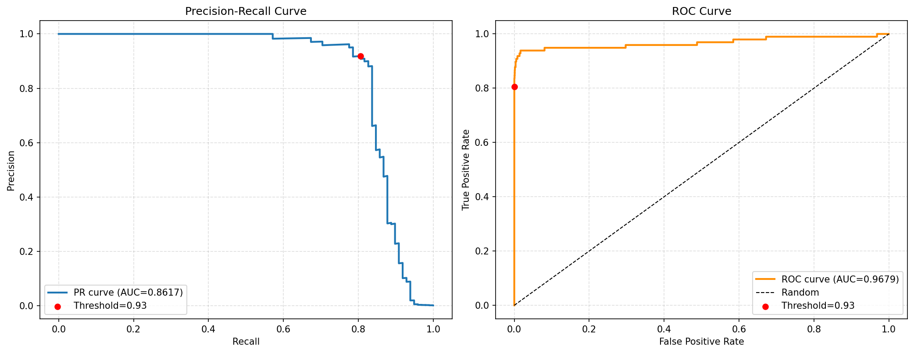
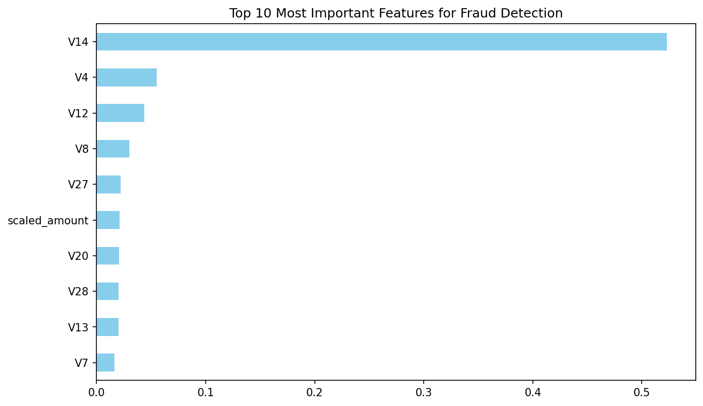

# 💳 Credit Card Fraud Detection

An end-to-end machine learning pipeline for detecting fraudulent credit card transactions on a highly imbalanced dataset (~0.17% fraud rate).

## Overview

This project builds and compares classification models to flag fraudulent transactions, with a focus on handling severe class imbalance correctly — SMOTE is applied only inside cross-validation training folds to avoid data leakage, and the decision threshold is tuned on out-of-fold predictions rather than the test set.

**Dataset:** [Credit Card Fraud Detection (Kaggle)](https://www.kaggle.com/datasets/mlg-ulb/creditcardfraud) — 284,807 transactions made by European cardholders in September 2013, with features `V1`–`V28` (PCA-anonymized), `Time`, `Amount`, and the target `Class` (1 = fraud, 0 = genuine).

## Pipeline

1. **EDA** — class distribution, transaction amount/time distributions, correlation analysis
2. Preprocessing — `RobustScaler` on `Amount` and `StandardScaler` on `Time`, applied via a `ColumnTransformer` as the first step inside each model pipeline (not as a separate manual step), so scaling is automatically fit on training folds only
3. **Model comparison** — Logistic Regression, Random Forest, and XGBoost, evaluated with 5-fold stratified cross-validation on recall, precision, F1, and PR-AUC
4. **Imbalance handling** — SMOTE oversampling applied within CV folds (Logistic Regression); class weighting / `scale_pos_weight` for Random Forest and XGBoost
5. **Threshold tuning** — optimal decision threshold selected from out-of-fold predicted probabilities (F1-maximizing), not from the test set
6. **Final evaluation** — best model (XGBoost) evaluated on a held-out 20% test set: classification report, confusion matrix, ROC and precision-recall curves, feature importances
7. **Model export** — final pipeline + threshold saved with `joblib`

## Results

Final performance on the held-out test set, at the F1-optimal threshold (0.93) tuned on out-of-fold training predictions:

| Metric    | Score  |
|-----------|--------|
| Precision | 0.9186 |
| Recall    | 0.8061 |
| PR-AUC    | 0.8617 |
| ROC-AUC   | 0.9679 |

Because fraud is rare, **PR-AUC and recall matter more than accuracy** — a model that predicts "genuine" for everything would still be ~99.8% accurate while catching zero fraud. At this threshold, the model catches ~80% of fraudulent transactions while keeping false alarms low (~92% precision). ROC-AUC looks even stronger, but on this imbalanced a dataset it's partly inflated by the sheer volume of true negatives — PR-AUC is the more honest read on performance.

### Figures

| | |
|---|---|
|  |  |
|  |  |

*(More plots — amount/time distributions, correlation matrix — are in `images/` after running the notebook.)*

## Setup

### 1. Clone and install dependencies
```bash
git clone https://github.com/<your-username>/credit-card-fraud-detection.git
cd credit-card-fraud-detection
pip install -r requirements.txt
```

### 2. Get a Kaggle API token
1. Go to [kaggle.com/settings](https://www.kaggle.com/settings) → **API** section → **Create New Token**. Copy the token value shown (starts with `KGAT_...`).
2. **In Google Colab:** click the 🔑 **Secrets** icon in the left sidebar, add a new secret named `KAGGLE_API_TOKEN`, paste the token as its value, and enable notebook access. The notebook reads it from there.
3. **Locally:** `export KAGGLE_API_TOKEN=<your-token>` in your shell, or use the "Legacy API Credentials" option on the same settings page to download a `kaggle.json` and place it at `~/.kaggle/kaggle.json`.

⚠️ **Never paste your Kaggle token directly into a notebook cell or commit `kaggle.json` to the repo.** This repo's `.gitignore` already excludes `kaggle.json`, and the notebook is set up to read the token from Colab Secrets / environment variables instead.

### 3. Run the notebook
Open `fraud_detection.ipynb` in Jupyter or Colab and run all cells top to bottom. It will download the dataset via the Kaggle CLI, train the models, and save the final model to `fraud_model.joblib`.

## Project structure
```
.
├── fraud_detection.ipynb   # Main notebook: EDA, training, evaluation
├── requirements.txt        # Python dependencies
├── .gitignore
└── README.md
```

## Tech stack
`pandas` · `numpy` · `scikit-learn` · `xgboost` · `imbalanced-learn` · `matplotlib` · `seaborn`

## Notes / possible next steps
- Try `LightGBM` or a `VotingClassifier` ensemble of the top models
- Add SHAP values for model explainability
- Wrap the saved model in a simple Flask/FastAPI endpoint for inference
- Log experiments with MLflow instead of printing CV tables

## License
This project is released under the MIT License — see `LICENSE`. The dataset itself is provided by Kaggle/ULB under its own terms; see the dataset page for details.
